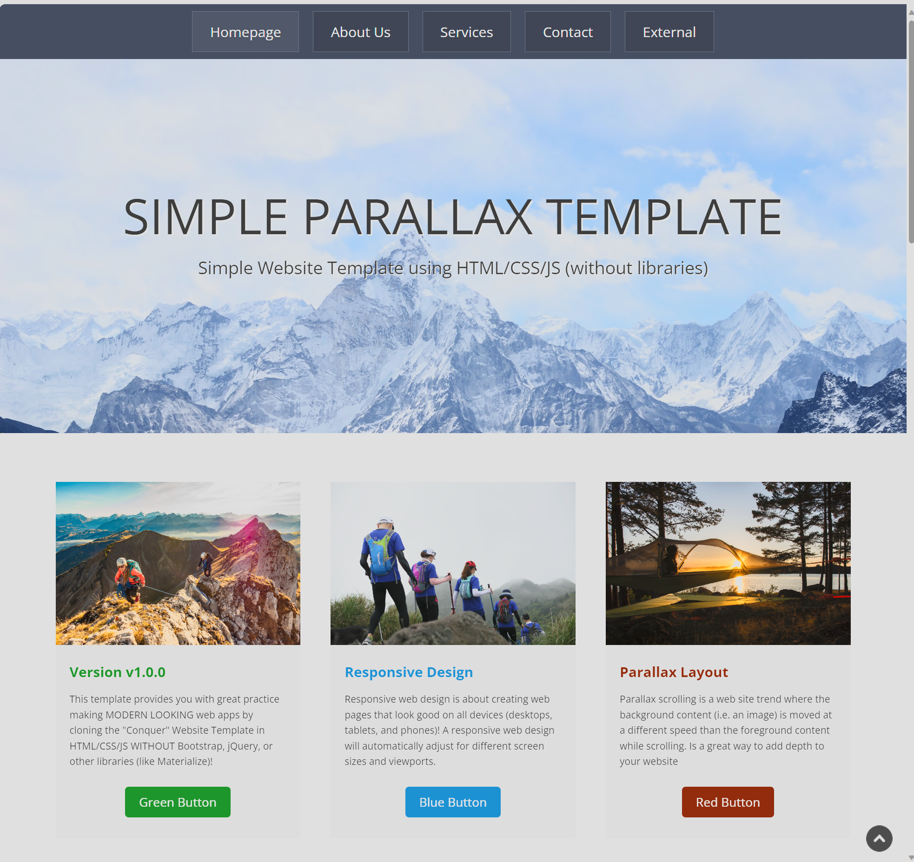

# SIMPLE PARALLAX TEMPLATE

## Overview

This project provides you with great practice making MODERN LOOKING web apps by cloning the "Conquer" Website Template in HTML/CSS/JS WITHOUT Bootstrap, jQuery, or other libraries (like Materialize)!

## Features 
* Parallax effect
* JavaScript Smooth Scrolling
* Responsive Web Design 
* Use of Flex-box, Media Queries

### LIVE LINK : 

## Credits
https://www.free-css.com/free-css-templates/page196/conquer#4

https://github.com/jmoralesg
